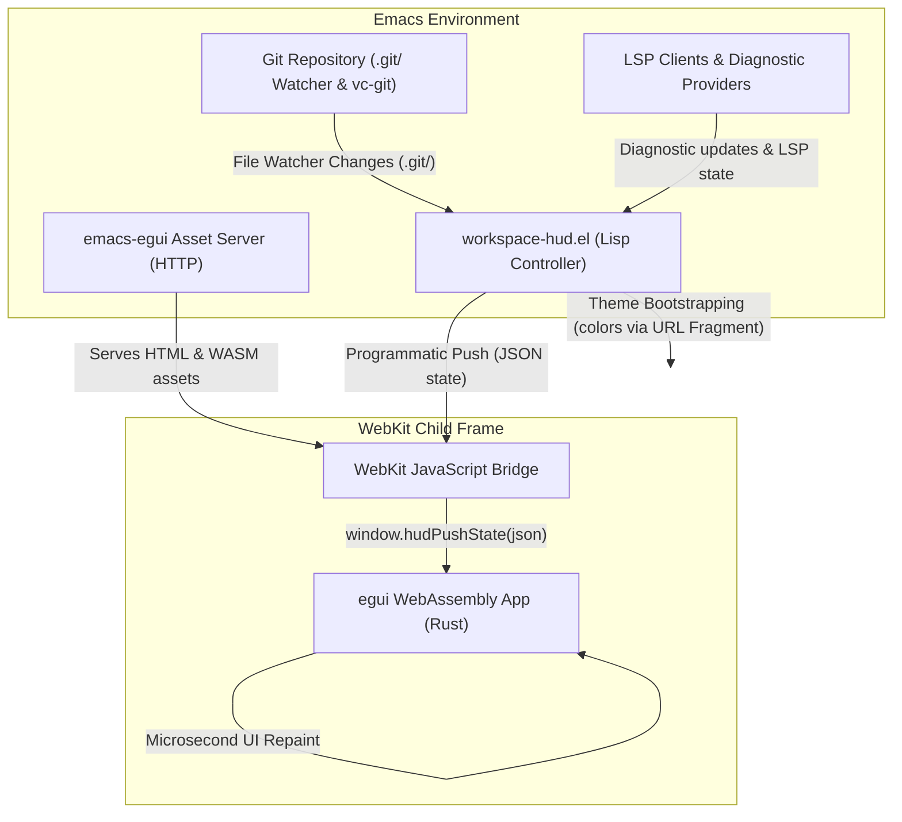
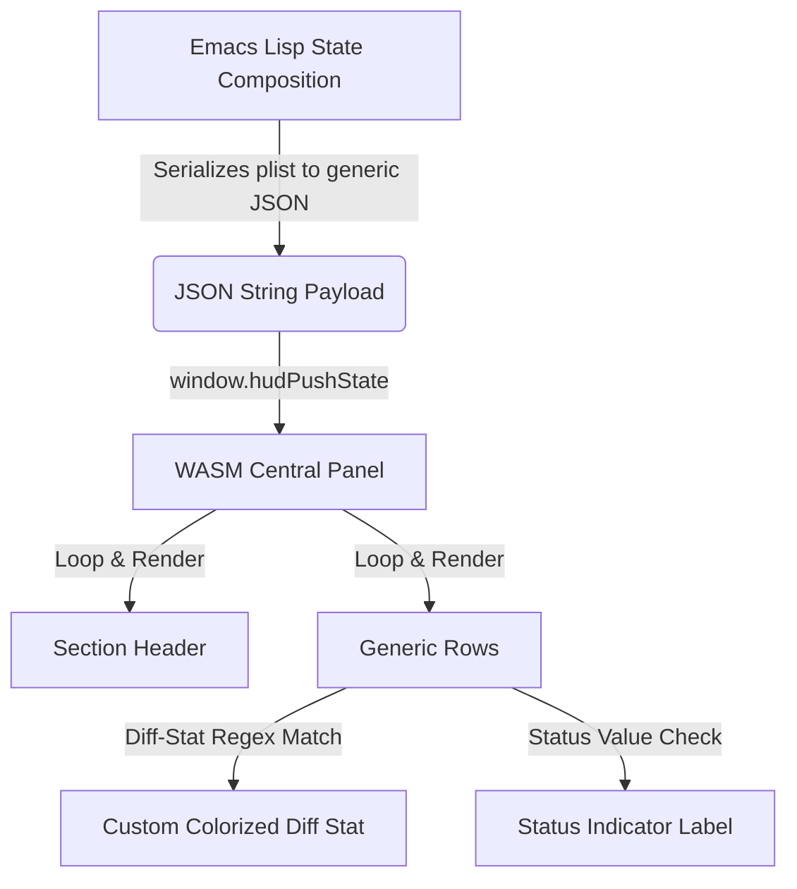

# Emacs Workspace HUD

[](https://github.com/nohzafk/emacs-egui)
[](https://www.rust-lang.org/)
[](https://webassembly.org/)
[](LICENSE)

A modern, highly polished, premium **Workspace Status Heads-Up Display (HUD)** for Emacs.

Layered on top of the generic [emacs-egui](https://github.com/nohzafk/emacs-egui) host framework, this package renders a gorgeous floating status card anchored to the top-right corner of your selected Emacs frame. The interface is built in Rust using egui, compiled to WebAssembly, and rendered smoothly inside a focusless `xwidget-webkit` child frame.

```text
  +----------------------------------------------------+
  | Emacs Window                                 [HUD] |
  |                                 +----------------+ |
  |                                 | WORKSPACE      | |
  |                                 | project        | |
  |                                 | main    up-to  | |
  |                                 | dirty   +0 -0  | |
  |                                 |                | |
  |                                 | HEALTH         | |
  |                                 | LSP     online | |
  |                                 | Diag    0 err  | |
  |                                 +----------------+ |
  |                                                    |
  |                                                    |
  +----------------------------------------------------+
```

## Information Model

The HUD should show **attention-worthy, contextual, actionable info** without becoming a second mode line, buffer list, or full dashboard.

For the current polish pass, the card is organized around two compact sections:

- **Workspace**: project, branch, upstream state, and dirty working tree summary.
- **Health**: LSP connection state and diagnostics counts.

Test information varies heavily from project to project, so it is intentionally not a first-class section yet. Instead, the HUD should prioritize signals that are commonly useful across most programming workspaces and cheap to collect from Emacs.

## Repository Layout

```text
emacs-workspace-hud/
├── lisp/
│   └── workspace-hud.el     # Core package: asset server + child frame lifecycle + Git collection
├── ui/                      # The egui/WASM status card renderer
│   ├── src/lib.rs           #   Rust egui app & push bindings
│   ├── index.html           #   HTML bootstrap shell (exposes JS/WASM bridges)
│   └── pkg/                 #   Generated WebAssembly bundle (wasm-pack output)
├── docs/                    # Architectural guidelines and detailed notes
├── tests/                   # ERT test suite covering server, path traversal, Git, and auto modes
└── Cargo.toml               # Workspace configuration
```

## ⚙️ Requirements

- **Emacs 29.1+** built **with xwidget support** (`(featurep 'xwidget-internal)`) and standard file notification support (`file-notify`).
- **git** installed on your system path (for workspace status collection).
- A standard **Rust toolchain** (2021 edition) and [`wasm-pack`](https://rustwasm.github.io/wasm-pack/) to compile the WebAssembly UI.
- Project automation: [`just`](https://github.com/casey/just) (optional, but highly recommended).

## 📦 Installation

The WebAssembly UI is compiled locally — there are **no prebuilt binaries in the repo** — and `emacs-egui` is vendored as a git submodule (it supplies both the Elisp framework and the Rust SDK used to build the UI). Every install must therefore (1) fetch submodules and (2) compile the Rust UI into `ui/pkg/`.

### Option A — `use-package` with `:vc` (Emacs 30+)

A single declaration clones the repo, initialises the bundled `emacs-egui` submodule, and compiles the WebAssembly UI — all at install time. You must opt in to the build step via `package-vc-allow-build-commands`, since `:shell-command` runs code on install.

```elisp
;; Allow the build step for this package (Emacs ignores :shell-command by default).
(setq package-vc-allow-build-commands '(emacs-workspace-hud))

;; package-vc does NOT fetch git submodules, so the build step initialises them
;; (providing the emacs-egui Elisp + Rust SDK) and then compiles the UI.
(use-package emacs-workspace-hud
  :vc (:url "https://github.com/nohzafk/emacs-workspace-hud"
       :rev :newest
       :lisp-dir "lisp"
       :shell-command
       "git submodule update --init --recursive && cd ui && wasm-pack build --target web --release")
  :bind ("C-c d h" . workspace-hud-toggle)
  :init
  (workspace-hud-auto-mode 1))
```

After `M-x package-vc-upgrade`, rebuild the UI with `M-x package-vc-rebuild RET emacs-workspace-hud`. On Emacs 29 (no `use-package` `:vc`) use Option B.

### Option B — Manual clone + raw Emacs Lisp (Emacs 29.1+)

```sh
git clone --recurse-submodules https://github.com/nohzafk/emacs-workspace-hud.git \
  ~/src/emacs-workspace-hud
cd ~/src/emacs-workspace-hud
just setup   # one-time: wasm32-unknown-unknown target + wasm-pack
just wasm    # build the UI into ui/pkg/
# (already cloned shallow? git submodule update --init --recursive)
# (if you don't have just: cd ui && wasm-pack build --target web --release)
```

```elisp
;; Only this package's lisp/ is needed -- the bundled emacs-egui is discovered
;; automatically (or an emacs-egui already on your load-path is used instead).
(add-to-list 'load-path "~/src/emacs-workspace-hud/lisp")
(require 'workspace-hud)

;; Toggle the HUD manually:
(keymap-set global-map "C-c d h" #'workspace-hud-toggle)

;; Or enable automatic mode to show HUD for Git repos and hide elsewhere:
(workspace-hud-auto-mode 1)
```

## 🚀 Usage

Once installed, you can control the Workspace HUD using two primary interactive commands:

### `M-x workspace-hud-toggle`

Manually show or hide the floating status card anchored to the top-right corner of the active frame. You can bind this command to any key prefix of your choice, for example:

```elisp
(keymap-set global-map "C-c d h" #'workspace-hud-toggle)
```

### `M-x workspace-hud-auto-mode`

A global minor mode that manages the HUD's visibility automatically. When enabled, the status card seamlessly appears whenever you enter a file or buffer belonging to a Git repository, and automatically slides out of sight when you focus on non-repository buffers (such as `dired`, `*scratch*`, or help pages).

```elisp
(workspace-hud-auto-mode 1)
```

## How It Works (Data Flow)



1. **Lifecycle Activation**: Calling `workspace-hud-toggle` or changing buffers in auto-mode launches the tiny pure-Elisp HTTP server and maps the xwidget child frame to the top-right corner.
2. **Theme Bootstrapping**: Emacs reads your current active theme colors (background, foreground, and font heights) and passes them to WebKit via a URL fragment (e.g. `#bg=#0c0c10&fg=#e6ebff`) to guarantee a seamless, zero-flash first paint.
3. **Data Collection & Real-Time Watching**: Emacs queries your workspace using `vc-git` to gather project details (staged/unstaged files, commits, ahead/behind statistics). To keep the display perfectly in sync with external terminal actions (such as `git branch`, `git commit`, `git add`, etc.), Emacs establishes a lightweight, non-recursive background watcher on the repository's `.git/` directory, immediately triggering a debounced status refresh on any commit, branch switch, pull, or staging activity.
4. **Programmatic Pushes**: Emacs encodes the workspace state plist to JSON and calls the WebKit bridge `window.hudPushState(json)` dynamically. Egui replaces the state model and requests an immediate repaint, redrawing the canvas in microseconds.

## 🧩 Extension API & Generic Rendering

`emacs-workspace-hud` supports a fully generic extension API, allowing third-party packages to register custom sections dynamically.

### State & Rendering Pipeline



To register a dynamic HUD section from an external package:

```elisp
(workspace-hud-set-section 'my-extension
  '(:title "My Extension"
    :priority 30
    :rows ((:label "Status" :value "active" :status "ok" :icon "project")
           (:label "Progress" :value "75%" :icon "changes"))))
```

To remove the section:

```elisp
(workspace-hud-remove-section 'my-extension)
```

### 📐 Dynamic Height Calculation

To prevent screen clipping or scrollbar artifacts, the HUD's child frame height is dynamically calculated in Emacs Lisp on every refresh before repositioning. The panel size is computed using the following layout formula:

$$\text{Height} = 28 + \sum_{i=1}^S (35 + 24 R_i) + 7(S - 1)$$

Where:
* $S$ is the number of active sections.
* $R_i$ is the number of rows in section $i$.
* $28\text{ px}$ represents the static top and bottom inner margins ($14 \times 2$).
* $35\text{ px}$ is the height of a section header plus its separator line and spacing ($22 + 4 + 9$).
* $24\text{ px}$ is the vertical height of a single row.
* $7\text{ px}$ is the spacing applied between sections.

The height is automatically clamped to a configurable range:
- `workspace-hud-min-height` (default `150`)
- `workspace-hud-max-height` (default `500`)

## Why a local HTTP server?

WebKit refuses to instantiate WebAssembly from `file://` origins for security reasons, so the assets must be served over an `http://` origin. Rather than relying on external web daemons, global network listeners, npm, or CDN dependencies, this package runs a **tiny HTTP server in pure Emacs Lisp** (`make-network-process`) bound to `127.0.0.1` on an ephemeral port. It serves only the HUD's compiled `index.html` and `pkg/` WASM bundle entirely in-process and securely.
