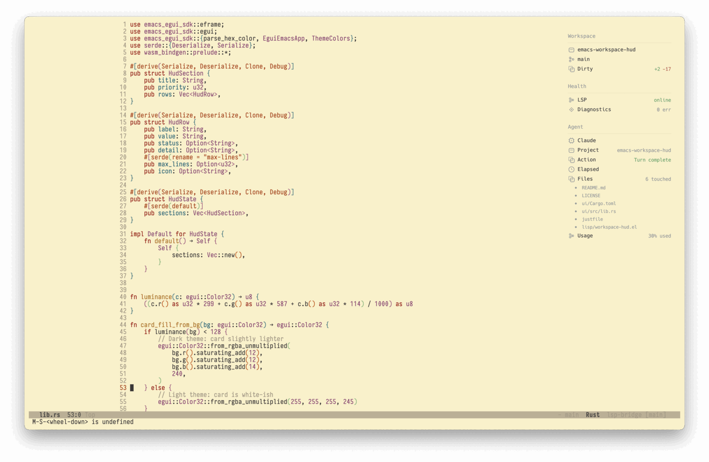
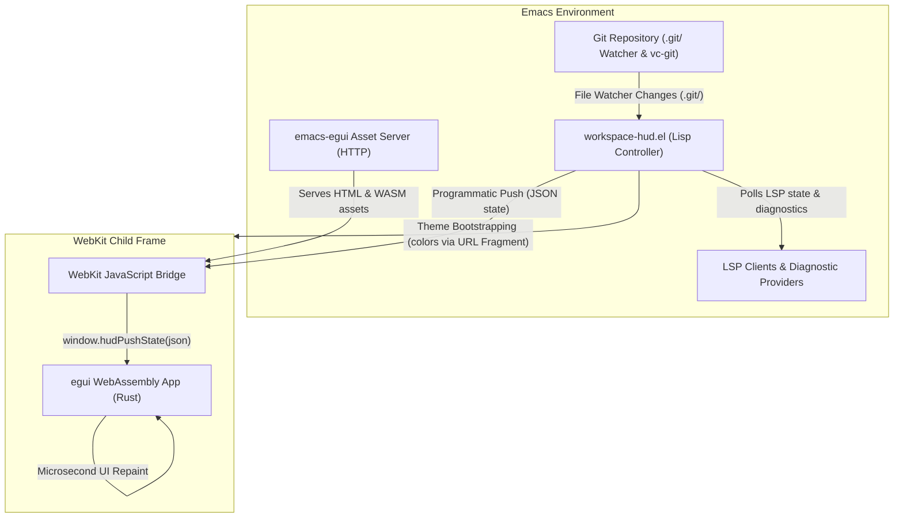
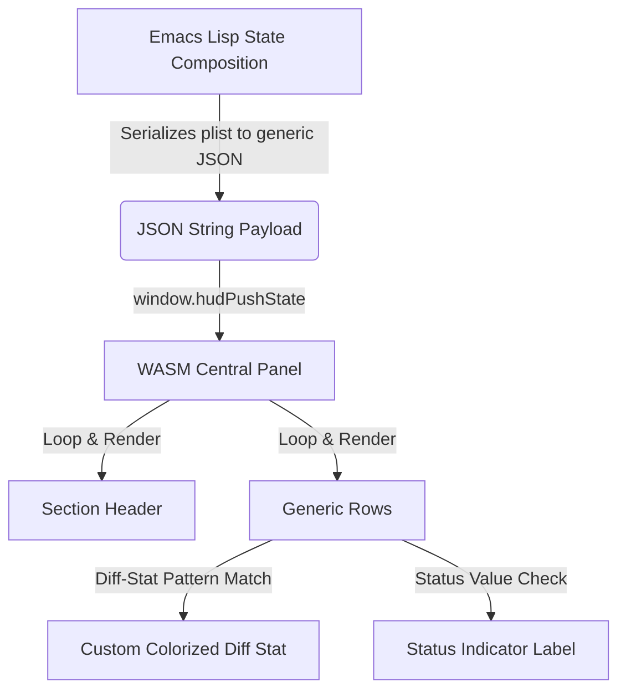

# Emacs Workspace HUD

[](https://github.com/nohzafk/emacs-egui)
[](https://www.rust-lang.org/)
[](https://webassembly.org/)

A **Workspace Status Heads-Up Display (HUD)** for Emacs -- a floating status card anchored to the top-right corner of your frame, showing project, Git, LSP, and diagnostic state at a glance.

Built on the [emacs-egui](https://github.com/nohzafk/emacs-egui) framework: a Rust/egui UI compiled to WebAssembly, rendered inside a focusless `xwidget-webkit` child frame.


*The "Agent" section is provided by [agent-shell-hud](https://github.com/nohzafk/agent-shell-hud) via the [Extension API](#extension-api).*

## Information Model

The HUD shows **attention-worthy, contextual, actionable info** -- not a second mode line or full dashboard.

Out of the box, two built-in sections are provided:

- **Workspace** (priority 10): project name, branch, upstream ahead/behind, and dirty working tree summary (insertions/deletions from staged + unstaged diffs).
- **Health** (priority 20): LSP connection state (auto-detected from Eglot, lsp-bridge, or lsp-mode) and diagnostic counts (from Flycheck or Flymake).

Additional sections can be added dynamically via the [Extension API](#extension-api). Sections are sorted by priority (lower numbers appear first).

## Repository Layout

```text
emacs-workspace-hud/
├── lisp/
│   └── workspace-hud.el     # Core package: child frame lifecycle + Git/LSP collection + extensions
├── emacs-egui/              # Git submodule: Elisp framework + Rust SDK
│   ├── lisp/emacs-egui.el   #   HTTP asset server, xwidget session mgmt, JSON IPC bridges
│   └── sdk/                 #   Rust crate: EguiEmacsApp trait, theme, state push, reverse callbacks
├── ui/                      # The egui/WASM status card renderer
│   ├── Cargo.toml           #   Rust crate manifest (dependencies, wasm target)
│   ├── src/lib.rs           #   Rust egui app: generic section/row rendering, icons, status colors
│   ├── index.html           #   HTML bootstrap shell (exposes JS/WASM bridges)
│   └── pkg/                 #   Generated WebAssembly bundle (wasm-pack output)
├── docs/                    # Architecture notes and design documents
├── tests/                   # ERT test suite covering Git collection, extensions, LSP, and auto modes
└── justfile                 # Task runner: setup, wasm, test, compile, check, clean
```

## Requirements

- **Emacs 29.1+** built with **xwidget support** (`(featurep 'xwidget-internal)`) and `file-notify`.
- **git** on your system path.
- **Rust toolchain** (2021 edition) and [`wasm-pack`](https://rustwasm.github.io/wasm-pack/) to compile the WebAssembly UI.
- [`just`](https://github.com/casey/just) task runner (optional, but recommended).

## Installation

The WebAssembly UI is compiled locally -- there are no prebuilt binaries. `emacs-egui` is vendored as a git submodule (Elisp framework + Rust SDK). Every install must (1) fetch submodules and (2) compile the Rust UI into `ui/pkg/`.

### Option A -- `use-package` with `:vc` (Emacs 30+)

A single declaration clones the repo, initialises the submodule, and compiles the UI at install time. You must opt in via `package-vc-allow-build-commands` since `:shell-command` runs code on install.

```elisp
;; Allow the build step for this package (Emacs ignores :shell-command by default).
(setq package-vc-allow-build-commands '(emacs-workspace-hud))

;; package-vc does NOT fetch git submodules, so the build step initialises them
;; (providing the emacs-egui Elisp + Rust SDK) and then compiles the UI.
(use-package emacs-workspace-hud
  :vc (:url "https://github.com/nohzafk/emacs-workspace-hud"
       :rev :newest
       :lisp-dir "lisp"
       :shell-command
       "git submodule update --init --recursive && cd ui && wasm-pack build --target web --release")
  :bind ("C-c d h" . workspace-hud-toggle)
  :init
  (workspace-hud-auto-mode 1))
```

After `M-x package-vc-upgrade`, rebuild the UI with `M-x package-vc-rebuild RET emacs-workspace-hud`. On Emacs 29 (no `:vc` support) use Option B.

### Option B -- Manual clone (Emacs 29.1+)

```sh
git clone --recurse-submodules https://github.com/nohzafk/emacs-workspace-hud.git \
  ~/src/emacs-workspace-hud
cd ~/src/emacs-workspace-hud
just setup   # one-time: wasm32-unknown-unknown target + wasm-pack
just wasm    # build the UI into ui/pkg/
# (already cloned shallow? git submodule update --init --recursive)
# (if you don't have just: cd ui && wasm-pack build --target web --release)
```

```elisp
;; Only this package's lisp/ is needed -- the bundled emacs-egui is discovered
;; automatically (or an emacs-egui already on your load-path is used instead).
(add-to-list 'load-path "~/src/emacs-workspace-hud/lisp")
(require 'workspace-hud)

;; Toggle the HUD manually:
(keymap-set global-map "C-c d h" #'workspace-hud-toggle)

;; Or enable automatic mode to show HUD for Git repos and hide elsewhere:
(workspace-hud-auto-mode 1)
```

## Usage

Interactive commands:

| Command | Description |
|---|---|
| `workspace-hud-toggle` | Show or hide the HUD. When auto-mode is active, hiding via toggle pauses auto-mode until the next manual toggle-on. |
| `workspace-hud-auto-mode` | Global minor mode. Automatically shows the HUD in Git-backed buffers and hides it elsewhere. |
| `workspace-hud-show` | Show the HUD (initializes the xwidget session on first call). |
| `workspace-hud-hide` | Hide the HUD frame without destroying the session. |
| `workspace-hud-refresh` | Force an immediate data collection and UI push. |
| `workspace-hud-cleanup` | Fully tear down the frame, xwidget session, file watches, and hooks. Also runs automatically on `kill-emacs-hook`. |

```elisp
;; Bind toggle to a key:
(keymap-set global-map "C-c d h" #'workspace-hud-toggle)

;; Enable automatic visibility management:
(workspace-hud-auto-mode 1)
```

## Customization

All options live in the `workspace-hud` customize group (`M-x customize-group RET workspace-hud`).

| Variable | Default | Description |
|---|---|---|
| `workspace-hud-width` | `260` | Width of the child frame in pixels. |
| `workspace-hud-min-height` | `150` | Minimum child frame height in pixels. |
| `workspace-hud-max-height` | `500` | Maximum child frame height in pixels. |
| `workspace-hud-margin-right` | `19` | Horizontal offset from the right edge of the parent frame. |
| `workspace-hud-margin-top` | `20` | Vertical offset from the top edge of the parent frame. |
| `workspace-hud-debounce` | `0.5` | Idle seconds before refreshing after a buffer or window change. |
| `workspace-hud-surface-background` | `nil` | Optional panel surface color. When `nil`, the default face background is used. |
| `workspace-hud-show-predicates` | `'(workspace-hud-default-show-predicate)` | List of predicate functions deciding if the HUD should be visible. |

### Visibility Rules

To reduce clutter, the HUD dynamically shows or hides itself based on your active buffer:

- **Automatic mode** (`workspace-hud-auto-mode`): Shows the HUD only in programming buffers (`prog-mode`) that are **inside a Git repository**. It automatically hides in special buffers (like `*Messages*`, `*Help*`, etc.), standard text buffers, or when outside of a Git repository.
- **Manual mode** (`workspace-hud-toggle`): Shows the HUD in all `prog-mode` buffers (even if they are outside a Git repository, where it will display `"No project"`). It automatically hides when switching to special or non-programming buffers, and restores itself when you switch back to code.

### Customizing Visibility

You can customize the showing conditions by modifying the `workspace-hud-show-predicates` list. The HUD will be displayed if **any** predicate in the list returns non-nil for the target buffer.

For example, to also show the HUD in `org-mode` buffers:

```elisp
(add-to-list 'workspace-hud-show-predicates
             (lambda (buf)
               (with-current-buffer buf
                 (derived-mode-p 'org-mode))))
```

Integration packages like `agent-shell-hud` use this same mechanism to keep the HUD visible when inside agent shell or viewport buffers:

```elisp
(add-to-list 'workspace-hud-show-predicates #'agent-shell-hud--show-predicate)
```

## Optional Integrations

The HUD detects and integrates with the following packages at runtime -- none are required:

**LSP status** (checked in order of priority):

- [Eglot](https://github.com/joaotavora/eglot) (built-in from Emacs 29)
- [lsp-bridge](https://github.com/manateelazycat/lsp-bridge)
- [lsp-mode](https://github.com/emacs-lsp/lsp-mode)

**Diagnostics** (first available wins):

- [Flycheck](https://github.com/flycheck/flycheck) (preferred)
- [Flymake](https://www.gnu.org/software/emacs/manual/html_node/flymake/) (fallback)

**Buffer list filtering**:

- [Consult](https://github.com/minad/consult) -- the HUD's internal xwidget buffer is automatically added to `consult-buffer-filter` to prevent it from appearing in `consult-buffer`.

## How It Works (Data Flow)



1. **Lifecycle Activation**: Calling `workspace-hud-toggle` or changing buffers in auto-mode launches the tiny pure-Elisp HTTP server and maps the xwidget child frame to the top-right corner.
2. **Theme Bootstrapping**: Emacs reads your current active theme colors (background, foreground, and font heights) and passes them to WebKit via a URL fragment (e.g. `#bg=#0c0c10&fg=#e6ebff`) to guarantee a seamless, zero-flash first paint.
3. **Data Collection & Real-Time Watching**: On each refresh, Emacs queries workspace state via `vc-git` (branch, ahead/behind, staged/unstaged diffs) and polls LSP and diagnostic providers (Eglot/lsp-bridge/lsp-mode, Flycheck/Flymake). A lightweight `file-notify` watcher on the `.git/` directory triggers a debounced refresh on any commit, branch switch, pull, or staging activity.
4. **Programmatic Pushes**: Emacs encodes the state plist to JSON and calls `window.hudPushState(json)` via the WebKit bridge. Egui replaces the state model and repaints immediately.

## Extension API

Third-party packages can register custom HUD sections dynamically.

### State & Rendering Pipeline



To register a dynamic HUD section from an external package:

```elisp
(workspace-hud-set-section 'my-extension
  '(:title "My Extension"
    :priority 30
    :rows ((:label "Status" :value "active" :status "ok" :icon "project")
           (:label "Progress" :value "75%" :icon "changes"))))
```

To remove the section:

```elisp
(workspace-hud-remove-section 'my-extension)
```

### Row Schema

Each row is a plist with the following keys:

| Key | Required | Type | Description |
|---|---|---|---|
| `:label` | yes | string | Left-side label text. |
| `:value` | yes | string | Right-side display value (use `""` for empty). Values matching `+N -M` are rendered as colorized diff stats. |
| `:status` | no | string | Color indicator: `"ok"` (green), `"warn"` (orange), `"error"` (red), `"busy"` (blue), or omit for muted. |
| `:icon` | no | string | Icon name (see [Icon Reference](#icon-reference) below). |
| `:detail` | no | string | Additional detail text (reserved for future use). |
| `:max-lines` | no | integer | Maximum number of lines to render for multi-line values (reserved for future use). |

### Icon Reference

| Icon name | Visual | Description |
|---|---|---|
| `"project"` | Document outline | Project/folder identity. |
| `"branch"` | Three-node branch graph | Git branch. |
| `"changes"` | Overlapping squares | Diffs / dirty file changes. |
| `"lsp"` | Three-node network graph | LSP connection state. |
| `"diagnostics"` | Diamond with center dot | Errors, warnings, notes. |
| `"agent"` | IC-chip with pins | AI agent / external process. |
| `"clock"` | Circle with hands | Timing / duration. |
| `"dot"` | Small filled circle | **Sub-row indicator.** Rows using this icon render in a compact sub-row layout: 18 px height (vs 22 px), indented, smaller font, and muted label color. Use it for hierarchical detail beneath a parent row. |

### Dynamic Height Calculation

The child frame height is dynamically calculated on every refresh to prevent clipping or scrollbar artifacts:

$$\text{Height} = 28 + \sum_{i=1}^S (35 + 24 R_i) + 18(S - 1)$$

Where:

- $S$ is the number of active sections.
- $R_i$ is the number of rows in section $i$.
- $28\text{ px}$ represents the static top and bottom inner margins ($14 \times 2$).
- $35\text{ px}$ is the height of a section header plus its separator line and spacing ($22 + 4 + 9$).
- $24\text{ px}$ is the vertical height of a single row.
- $18\text{ px}$ is the spacing applied between sections.

The height is automatically clamped to a configurable range:

- `workspace-hud-min-height` (default `150`)
- `workspace-hud-max-height` (default `500`)

## Development

[`just`](https://github.com/casey/just) task runner commands:

| Command | Description |
|---|---|
| `just setup` | Install the `wasm32-unknown-unknown` target and `wasm-pack`. |
| `just wasm` | Rebuild the WASM renderer into `ui/pkg/`. |
| `just compile` | Byte-compile the Elisp as a smoke test. |
| `just test` | Run the ERT test suite headless. |
| `just check` | Build + compile + test in sequence. |
| `just clean` | Remove compiled artifacts. |

Without `just`, run tests directly:

```sh
emacs -Q --batch -L lisp -L tests \
  -l tests/workspace-hud-tests.el \
  -f ert-run-tests-batch-and-exit
```

## Why a local HTTP server?

WebKit refuses to load WebAssembly from `file://` origins. Rather than requiring external web servers or CDN dependencies, `emacs-egui` runs a **tiny HTTP server in pure Emacs Lisp** (`make-network-process`) bound to `127.0.0.1` on an ephemeral port, serving only the HUD's `index.html` and WASM bundle.

